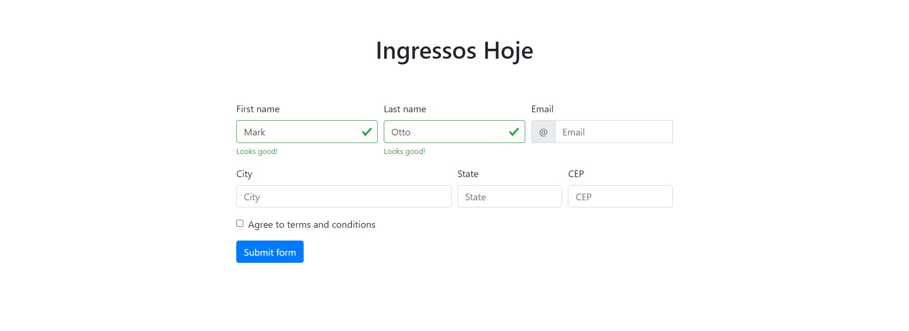

# tela-de-acesso
 login e criação de conta com bootstrap.

## 
Quando o usuario acessa a pagina de uma loja que vende ingressos ele se depara com o login onde ele tem que preencher o ususario e a senha, caso ele não tenha acesso, o usuario clica em cadastro
 
##
Quando o usuario vai fazer o cadastro, o site pede algumas informações, depois de colocar as informações ele vai ser direcionado para a pagina de login
 